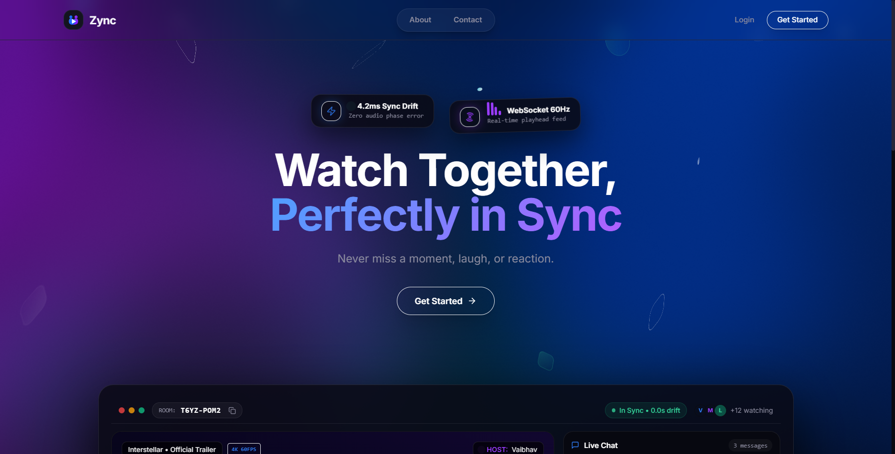
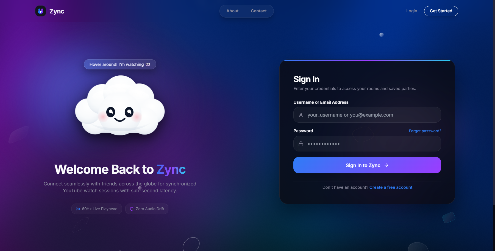
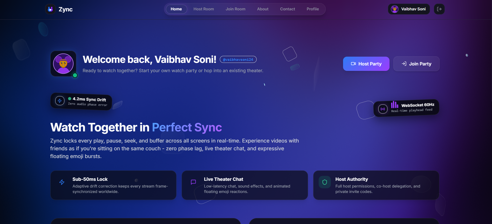
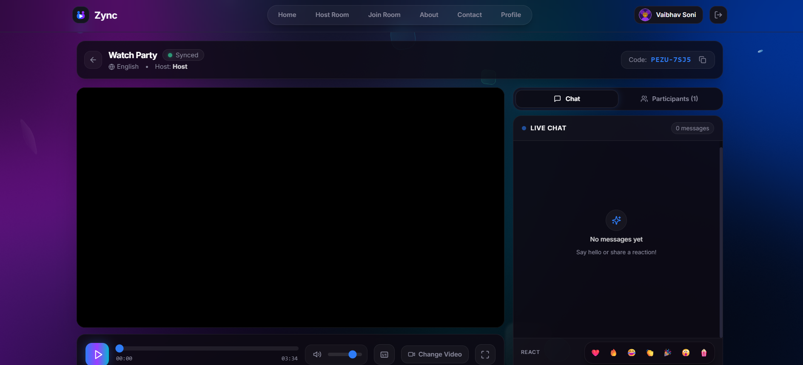
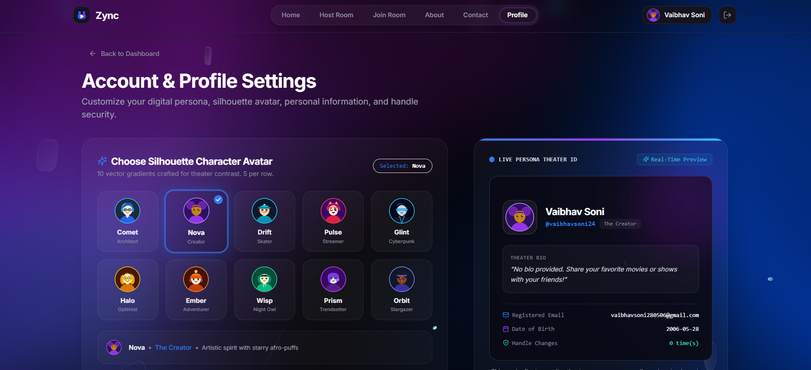

<div align="center">
  
  <h1>Zync</h1>
  <p><strong>Watch Together, Perfectly in Sync</strong></p>
  <p>
    An end-to-end synchronized watch-party theater platform designed with obsidian glass aesthetics, 60FPS WebGL smoke shaders, granular RBAC permissions, live chat, and YouTube Live-style physics reactions.
  </p>
  <p>
    <a href="https://zync-watch-party.vercel.app" target="_blank"><strong>🌐 Live Web App</strong></a> •
    <a href="#demo--screenshots"><strong>📸 Screenshots</strong></a> •
    <a href="#quick-start"><strong>🚀 Quick Start</strong></a>
  </p>
</div>

---

## 📸 Demo & Screenshots

<div align="center">

### 1. Landing Experience


### 2. Interactive Mascot & Secure Authentication


### 3. Dashboard & Active Public Theaters


### 4. Synchronized Theater Room


### 5. Profile Settings & Danger Zone


</div>

---

## ✨ Features

- ⏱️ **Sub-Second Playback Synchronization**:
  - Authoritative host playback engine with drift re-synchronization.
  - Zero-interruption join: new attendees smoothly synchronize to the ongoing stream without interrupting or pausing playback for existing viewers.
  - Transparent protective shield preventing uncoordinated direct clicks on the iframe; playback is managed solely through custom UI controls.

- 🛡️ **Granular Role-Based Access Control (RBAC)**:
  - **Host**: Complete control over playback, seeking, Closed Captions (CC), video selection, participant roles, and host delegation.
  - **Moderator**: Can control playback, toggle captions, change streams, chat, and react.
  - **Participant**: Can request temporary playback control, chat, and react.
  - **Viewer**: Non-intrusive spectator mode (isolated from chat and controls).

- 👑 **Automated Host Departure & Delegation**:
  - If the Host leaves the room and one or more moderators exist, **a random moderator is immediately promoted to Host**, database records are updated, and a system broadcast is announced in chat.
  - If no moderators are present when the host departs, the room is cleanly reclaimed and terminated, notifying remaining members.

- 🚪 **Accidental Navigation Guard**:
  - Integrated confirmation modal intercepts in-app link clicks, back navigation, and browser unload events to prevent attendees from accidentally dropping out of their active watch party.

- 💬 **Live Chat & YouTube Live-Style Floating Reactions**:
  - Real-time chat with timestamping, role badges, and an integrated 1-message/second anti-spam rate limiter.
  - Sine-wave floating emoji reactions rise smoothly over the video canvas in both standard and fullscreen theater modes.

- 🔤 **Closed Captions (CC) Host/Mod Control**:
  - Subtitles are disabled by default on player load.
  - Dedicated Captions toggle in the player control bar enables host and moderators to switch subtitles on or off for everyone.

- ☁️ **Interactive SVG Mascot**:
  - Expressive cloud mascot reacts to mouse movement, closes its eyes during password input, reacts when patted, and celebrates successful account actions.

- 🚨 **Account Danger Zone**:
  - Dedicated pages for password resets and irreversible account deletion protected by transactional 6-digit email OTPs.

- 🎨 **Obsidian Glass Design System**:
  - Ultra-modern dark obsidian theme (`#06040a`), glassmorphic panels (`#0d0a14/90`), glowing accents, 60FPS fluid WebGL smoke background shader, and tumbling 3D shapes.

---

## 🛠️ Tech Stack

| Layer | Technology | Purpose |
|---|---|---|
| **Frontend** | React 18, TypeScript, Vite, Tailwind CSS | High-performance SPA with modern tooling |
| **Motion & Graphics** | Framer Motion, HTML5 Canvas / WebGL | Physics reactions, 60FPS smoke shaders, fluid cards |
| **Real-time Engine** | Socket.IO, Socket.IO Redis Adapter | Low-latency state synchronization & clustering |
| **Backend** | Node.js, Express, TypeScript | REST APIs, OOP socket room management |
| **Database** | PostgreSQL, Prisma ORM | Relational persistence for accounts, rooms, history |
| **Cache & Pub/Sub** | Redis (Upstash) | Distributed socket adapter and ephemeral OTP TTLs |
| **Email Service** | Brevo API | Transactional OTP delivery and contact requests |
| **Streaming** | YouTube IFrame Player API | Video embedding and programmatic synchronization |

---

## 🏗️ System Architecture

```
┌────────────────────────────────────────────────────────┐
│                      Client                            │
│   React 18 + Vite + Zustand + WebGL Smoke Shader       │
└──────────────────────────┬─────────────────────────────┘
                           │ WebSocket / REST API
                           ▼
┌────────────────────────────────────────────────────────┐
│                   Express Server                       │
│    ├── REST Controllers (Auth, Rooms, Profile, Contact)│
│    └── OOP WebSocket Cluster Engine                    │
│         ├── RoleManager (Permission Checks)            │
│         ├── Room (Playback State, Chat Ring Buffer)    │
│         └── Participant (Socket Context & Identity)    │
└──────────────┬──────────────────────────┬──────────────┘
               │                          │
               ▼                          ▼
┌─────────────────────────┐    ┌─────────────────────────┐
│     PostgreSQL (DB)     │    │       Redis Cache       │
│  Prisma ORM (Accounts,  │    │  Upstash (Ephemeral OTP,│
│    Theaters, Sessions)  │    │   Distributed Pub/Sub)  │
└─────────────────────────┘    └─────────────────────────┘
```

---

## 🚀 Quick Start

### Prerequisites
- [Node.js](https://nodejs.org/) (v18 or higher)
- [npm](https://www.npmjs.com/) (v9 or higher)

### 1. Clone the Repository
```bash
git clone https://github.com/VaibhavSoni24/ZYNC.git
cd ZYNC
```

### 2. Install Dependencies
```bash
npm install
```

### 3. Configure Environment Variables
Copy `.env.example` and set up your values:
```bash
cp .env.example .env
```

| Variable | Description |
|---|---|
| `DATABASE_URL` | PostgreSQL connection string (e.g. Neon, Supabase, or local) |
| `REDIS_URL` | Redis connection URL (e.g. Upstash or local) |
| `JWT_ACCESS_SECRET` | Secret key for signing access tokens |
| `JWT_REFRESH_SECRET` | Secret key for signing refresh tokens |
| `BREVO_API_KEY` | *(Optional)* Brevo transactional email API key |
| `BREVO_SENDER_EMAIL` | Verified sender email address |
| `BREVO_SENDER_NAME` | Sender display name |
| `CLIENT_URL` | Frontend origin (e.g. `http://localhost:3000` or production URL) |
| `SERVER_URL` | Backend server URL (e.g. `http://localhost:5000` or production URL) |
| `PORT` | Server port (default: `5000`) |

*(Note: In local development, if `REDIS_URL` or `BREVO_API_KEY` are omitted, the server operates with simulated in-memory caching and console email logging.)*

### 4. Initialize Database
```bash
npm run prisma:generate --workspace=@zync/server
npm run prisma:push --workspace=@zync/server
```

### 5. Start Development
Run both frontend and backend concurrently:
```bash
npm run dev
```

- **Frontend Client**: [http://localhost:3000](http://localhost:3000)
- **Backend API**: [http://localhost:5000](http://localhost:5000)

---

## 🚢 Deployment

### Frontend (Vercel)
1. Import the repository into Vercel with Root Directory set to `apps/client`.
2. Set Framework to **Vite**.
3. Set the Environment Variable:
   - `VITE_SERVER_URL`: Your deployed server URL (e.g. `https://zync-server-zt02.onrender.com`).

### Backend (Render)
1. Create a new **Web Service** pointing to the repository.
2. Configure settings:
   - **Build Command**: `npm install && npm run build:shared && npm run build:server`
   - **Start Command**: `npm run start --workspace=@zync/server`
3. Add the production environment variables (`DATABASE_URL`, `CLIENT_URL`, `JWT_ACCESS_SECRET`, `JWT_REFRESH_SECRET`, `REDIS_URL`, etc.).

---

## 📄 License

This project is open source and available under the [MIT License](LICENSE).

Anyone is free to use, modify, distribute, and contribute to this codebase. Have fun building and watching!
